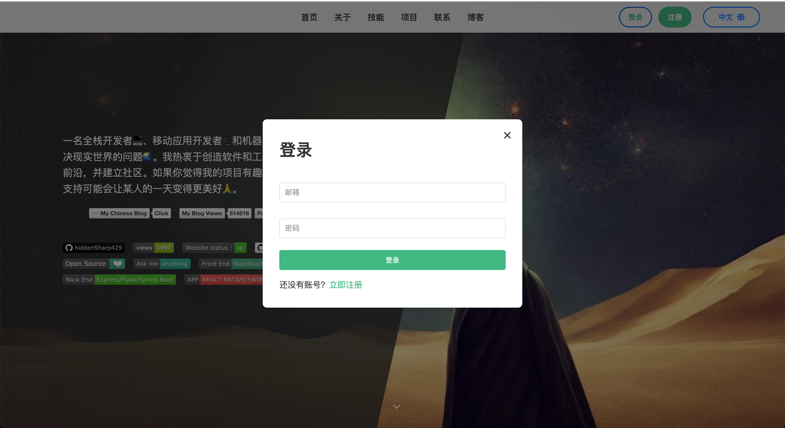
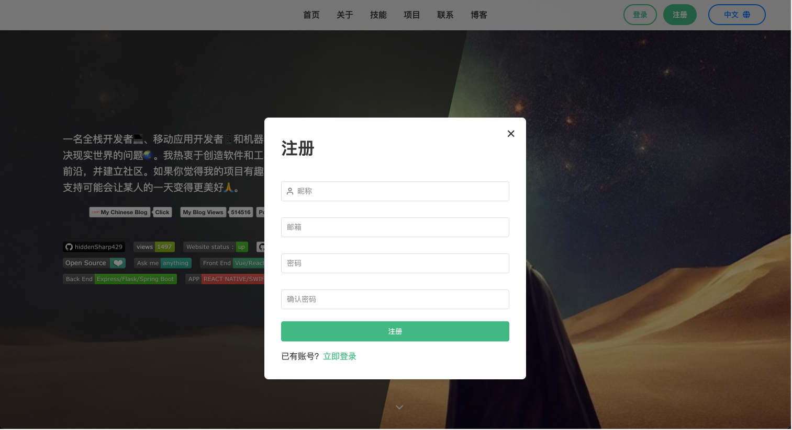
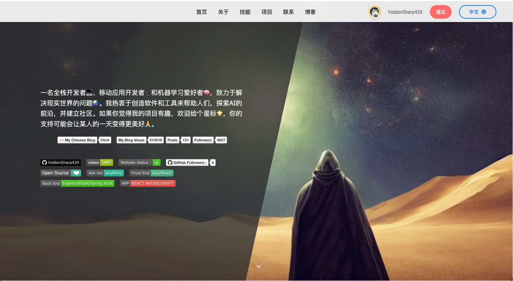
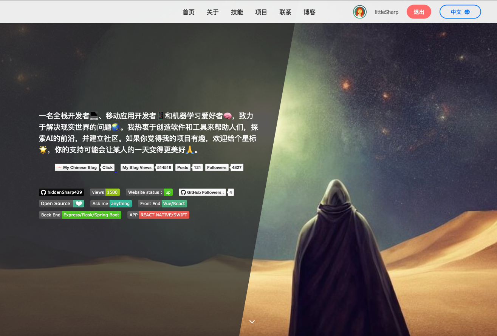
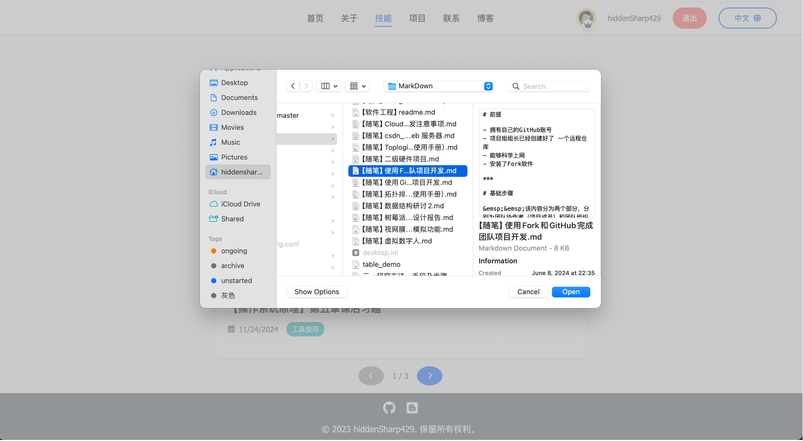
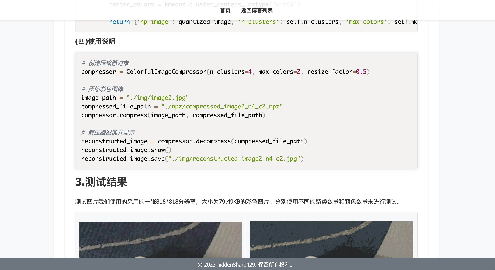
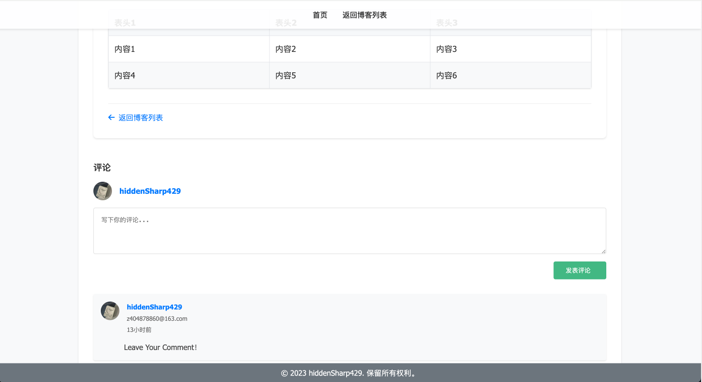
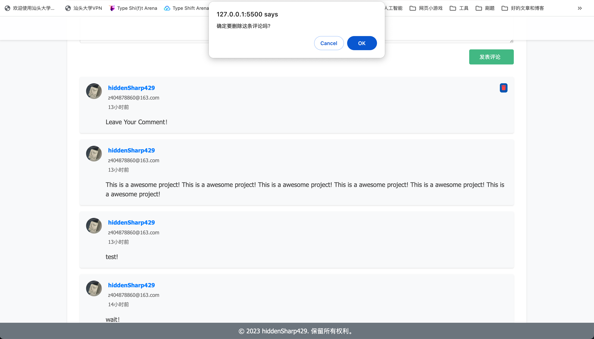
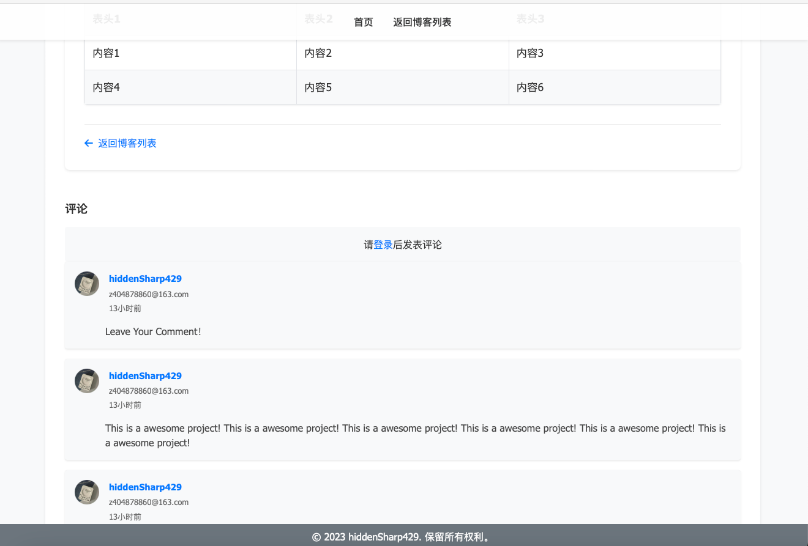

<!--
 * @Author: SheathedSharp z404878860@163.com
 * @Date: 2024-11-27 11:14:04
-->
# simple-portfolio-blog

A simple, responsive personal website built with HTML, CSS, and JavaScript.

## Features

- 🌍 Multi-language support (中文/English)
- 📝 Blog system with **Firebase** backend
- 🎨 Modern UI with smooth animations
- 📱 Fully responsive design
- 🔒 Authentication system
- 💾 **Firebase integration**

## Project Structure
```
📦 simple-portfolio-blog
├── 📂 assets # Static assets (images, icons, etc.)
├── 📂 blog # Blog-related components and styles
│ ├── 📂 components # Blog components (Publisher, Comments, etc.)
│ ├── 📂 config # Blog configuration (tags, etc.)
│ ├── 📂 styles # Blog-specific styles
│ ├── 📂 utils # Blog utilities
│ └── 📜 blog-detail.html
├── 📂 config # Site configuration
│ └── 📜 languages.json # Internationalization files
├── 📂 js # Core JavaScript modules
│ ├── 📜 AuthManager.js
│ ├── 📜 BlogManager.js
│ ├── 📜 GitHubManager.js
│ ├── 📜 LanguageManager.js
│ └── 📜 main.js
├── 📂 styles # Global styles
│ └── 📜 main.css
├── 📂 utils # Utility functions
│ ├── 📜 pathHelper.js
│ └── 📜 Toast.js
├── 📜 index.html # Main entry point
├── 📜 .gitignore
├── 📜 README.md
└── 📜 deploy.yml # GitHub Actions deployment configuration
```


### Key Directories

- **`/assets`**: Contains all static assets including images, icons, and media files
- **`/blog`**: Blog system components and related files
- **`/config`**: Configuration files including language translations
- **`/js`**: Core JavaScript modules and managers
- **`/styles`**: CSS stylesheets for the entire application
- **`/utils`**: Helper functions and utility classes

### Key Features by Directory

- **Blog System** (`/blog`):
  - Markdown support
  - Code syntax highlighting
  - LaTeX math rendering
  - Comment system
  - Tag management

- **Core Features** (`/js`):
  - Authentication management
  - Multi-language support
  - GitHub integration
  - Dynamic content loading

- **Styling** (`/styles`):
  - Responsive design
  - Dark/light theme
  - Smooth animations
  - Mobile-first approach

## ScreenShot











